# Motor de búsqueda de libros

## Descripción de la aplicación  

* La aplicación consiste en un motor de búsqueda de libros para poder buscar libros y guardarlos con el objetivo de tener una lista de libros para comprar.
* La aplicación emplea la API de Google Books para buscar libros por medio de un parámetro de búsqueda.
    * Los resultados de los libros incluyen el título, autor, descripción, imagen y un enlace a ese libro en el sitio de Google Books. El enlace que lleva a cada libro en el sitio de Google Books está ligado al título del libro.
* Cuando el usuario inicia sesión o se registra creando su cuenta, entonces puede guardar en su cuenta cualquiera de los libros arrojados por la búsqueda, para tenerlos disponibles como una lista de compra.
* La aplicación permite visualizar todos los libros guardados por el usuario cuando su sesión está activa. Estando en la sección de libros guardados, el usuario puede remover o borrar cualquiera de los libros guardados.
* Esta aplicación está desplegada usando Heroku.
    
## Enlace a la aplicación funcional

* [Enlace a aplicación]()

## Instrucciones de instalación  

* Esta aplicación requiere:

    * En General:
      * Instalación de:
        * Node JS versión 16.18.0
        * Paquete concurrently 5.2.0

    * En el lado del Cliente:
      * Instalación de: 
        * Paquete @apollo/client 3.5.8
        * Paquete @testing-library/jest-dom 4.2.4
        * Paquete @testing-library/react 9.3.2
        * Paquete @testing-library/user-event 7.1.2
        * Paquete bootstrap 4.4.1
        * Paquete graphql 15.4.0
        * Paquete jwt-decode 2.2.0
        * Paquete react 16.13.1
        * Paquete react-bootstrap 1.0.1
        * Paquete react-dom 16.13.1
        * Paquete react-router-dom 6.2.1
        * Paquete react-scripts 4.0.2
        * Paquete web-vitals 0.2.4

    * En el lado del Servidor:
        * Paquete express 4.17.1
        * Paquete nodemon 2.0.3
        * Paquete apollo-server-express 3.6.2
        * Paquete bcrypt 4.0.1
        * Paquete graphql 16.3.0
        * Paquete jsonwebtoken 8.5.1
        * Paquete mongoose 5.9.10
   
## Instrucciones para realizar pruebas 

* La ejecución de la aplicación se tiene que hacer desde la terminal de node.js
* Asegúrate de estar en la ubicación de la carpeta principal/raíz de la aplicación: SEARCH-ENGINE\      
  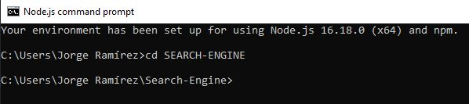
* Para instalar todos los paquetes necesarios tanto para el cliente, como para el servidor, ejecuta el comando "npm install" desde la terminal de node.js  
  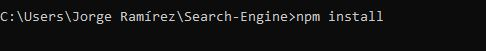
* Para construir la aplicación del lado del cliente, ejecuta el comando "npm run build" desde la terminal de node.js  
  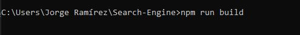
* Para iniciar el servidor y la aplicación, emplea el comando "npm run develop" desde la terminal de node.js      
  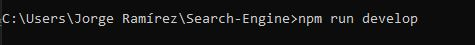
* Una vez que se haya terminado de hacer el proceso de inicialización, deberás ver un mensaje que indique "Starting the development server..." 
  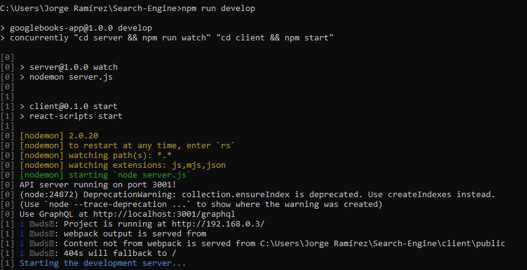
* A partir de este punto puedes emplear la dirección http://localhost:3000/ para acceder a la aplicación desde un navegador.  
  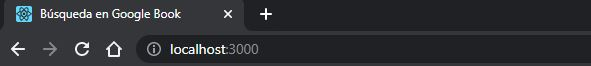

## Información de uso de la aplicación

* Una vez que hayas accedido a la aplicación mediante el link de [Heroku]() o si estás haciendo pruebas locales mediante la dirección http://localhost:3000/:
  * Puedes iniciar sesión o crear una cuenta en la aplicación presionando el link correspondiente en el menú de navegación superior derecho:  
      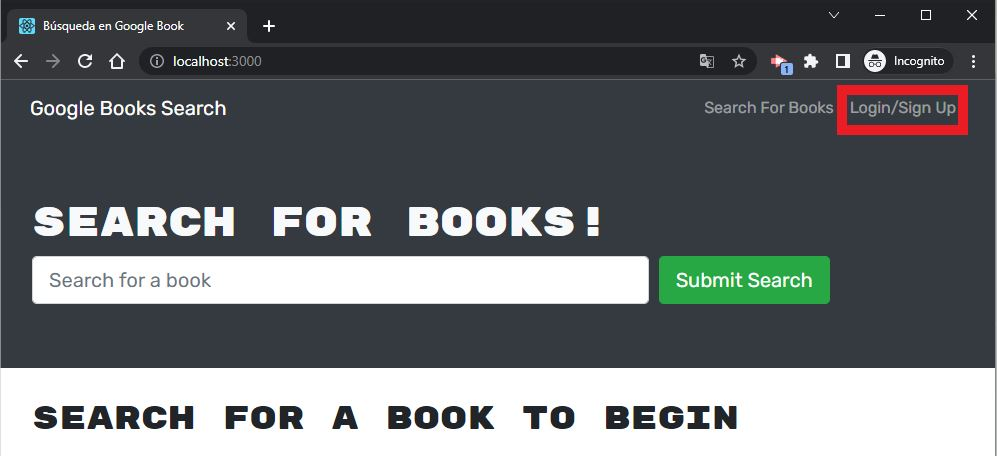   
    * Si ya tienes una cuenta, introduce tu correo electrónico y contraseña y presiona el botón de "Submit".  
        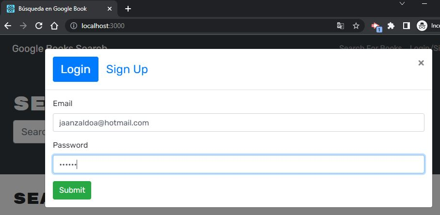
    * Si aún no tienes una cuenta:  
        * Presiona la pestaña de "Sign Up".  
            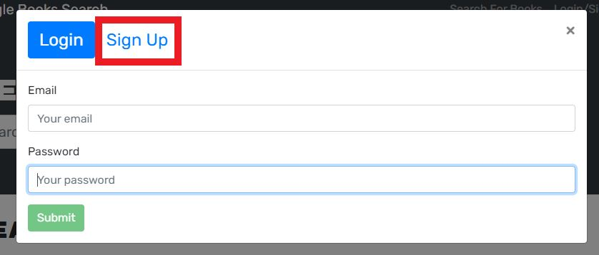  
        * Introduce un nombre de usuario, tu correo electrónico y contraseña y presiona el botón de "Submit".  
            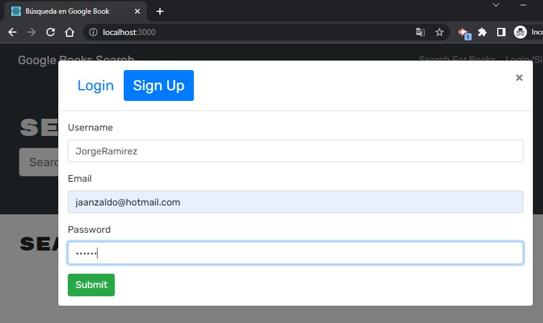  
  * Si tu proceso de inicio de sesión o creación de cuenta es correcto, entonces verás dos nuevas opciones en el menú de navegación superior derecho. Estas opciones son "See your books" y "Logout".
    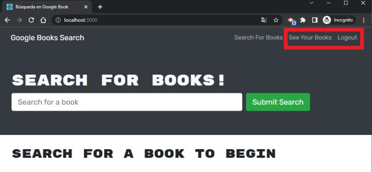 

  * Para buscar libros, introduce un parámetro de búsqueda en el campo de entrada y presiona el botón "Submit Search".  
    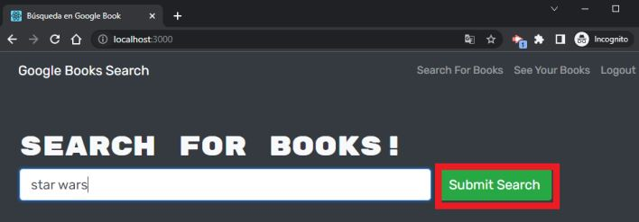  
  * La búsqueda arrojará máximo 10 resultados. Estos resultados incluyen el título, autor, descripción, imagen y un enlace a cada libro en el sitio de Google Books, si es que toda la información está disponible.  
    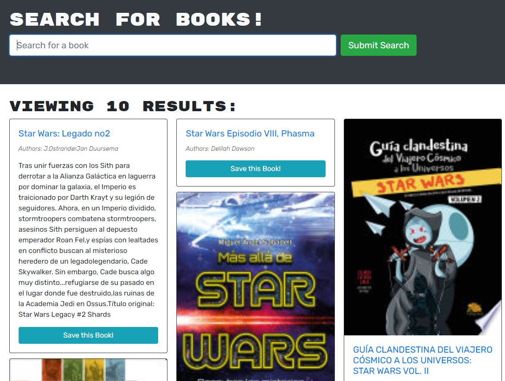  
    * El enlace a cada libro en el sitio de Google Books está en el título, si lo presionas, se abrirá una nueva pestaña en el navegador que te llevará al sitio de Google Books donde podrás ver la información del libro correspondiente.  
        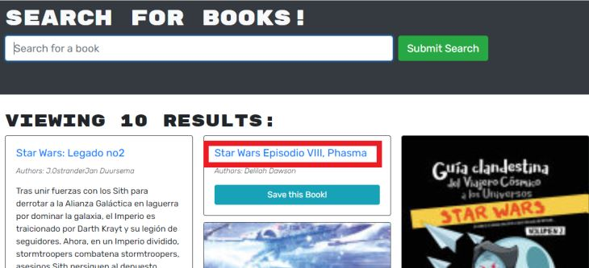  
        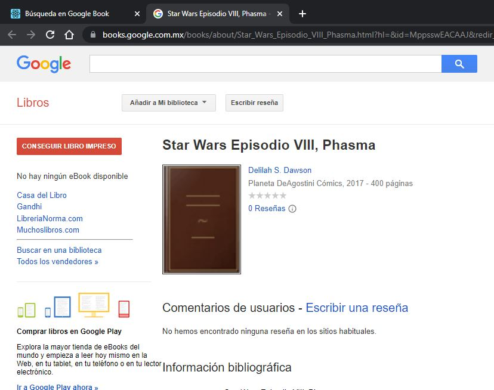      
  * Para agregar un libro a tu cuenta, entonces presiona el botón de "Save this Book!" del libro que deseas guardar, puedes agregar todos los que desees a tu cuenta:
    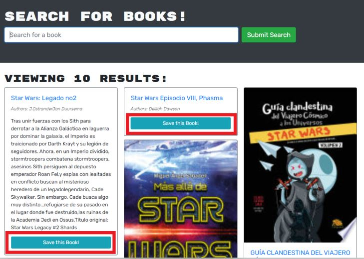  
  * Para ver los libros guardados en tu cuenta:
    * Accede a la opción "See your Books" en el menú de navegación superior derecho:  
        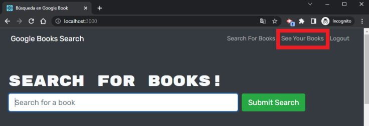  
    * Entonces podrás ver los libros que has guardado en tu cuenta:  
        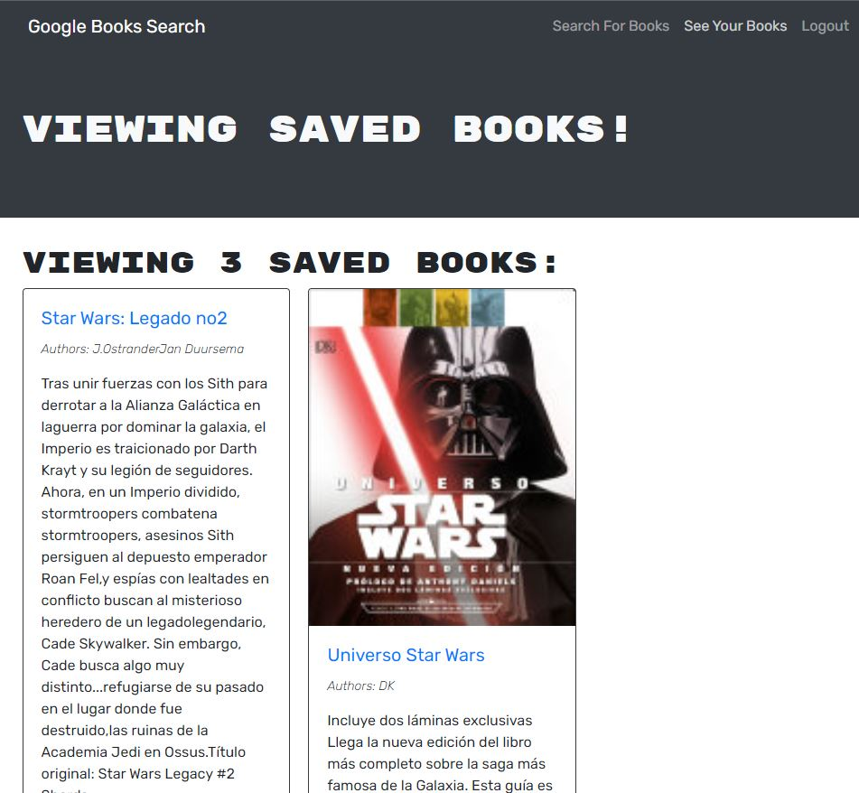  
    * Desde aquí también puedes eliminar libros que hayas guardado al presionar el botón "Delete this Book!". Una vez que lo hayas presionado, el libro desaparecerá inmediatamente. 
        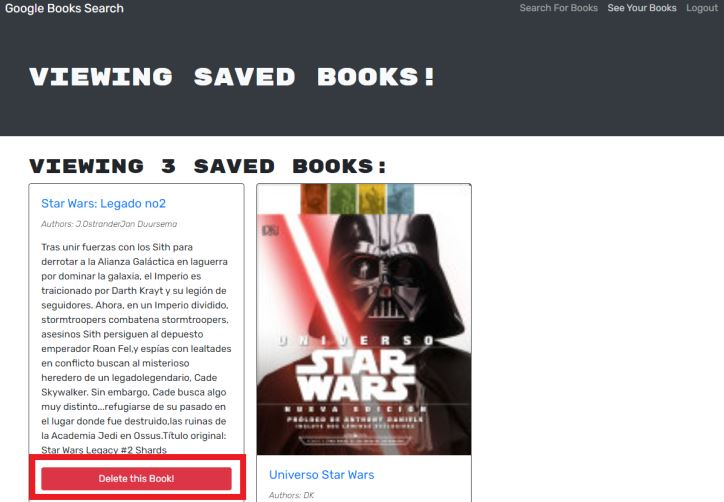 
  * Para cerrar tu sesión, presiona la opción "Logout" en el menú de navegación superior derecho:  
    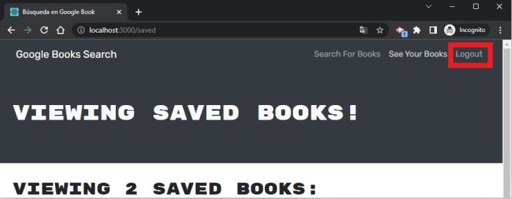   
  * Puedes seguir buscando libros aunque no hayas iniciado sesión, solamente no podrás guardarlos hasta que inicies sesión o crees una cuenta:  
    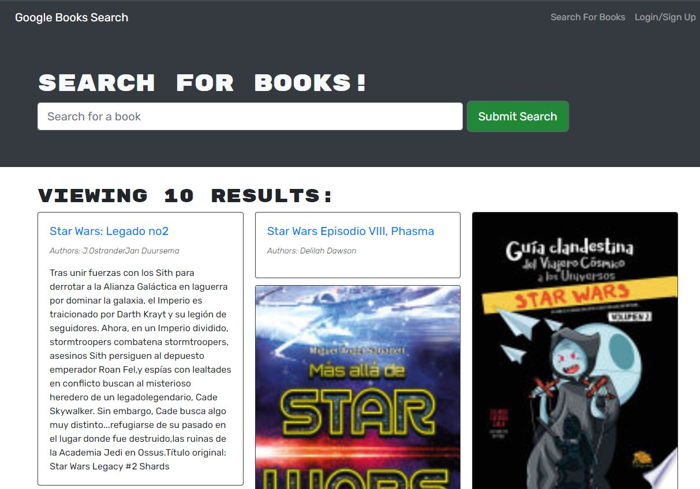   

## Apariencia de la aplicación

* 
